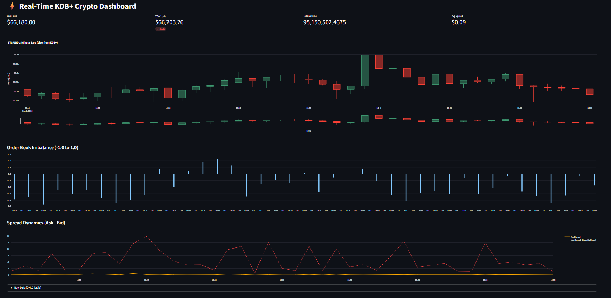
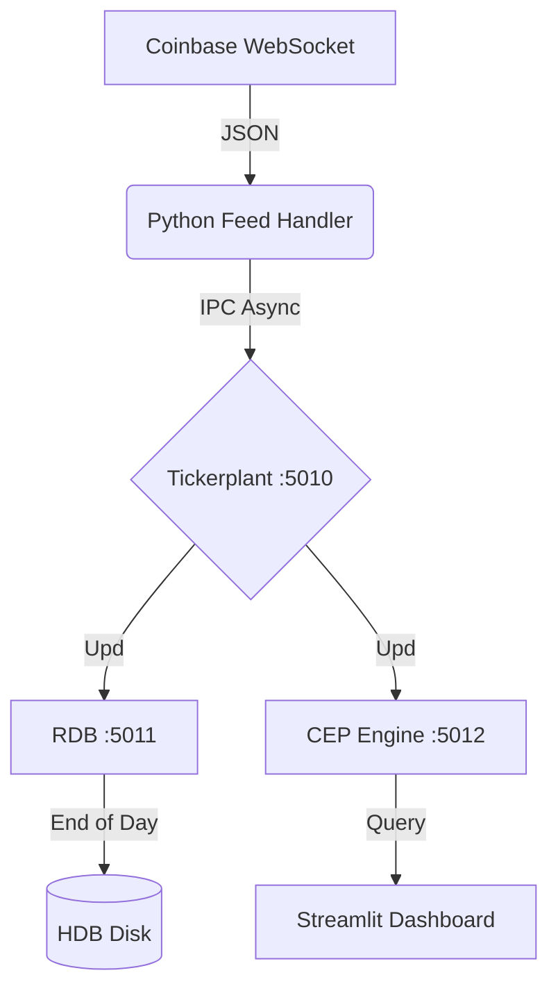

# Real-Time Crypto Analytics Engine (KDB+/q)

  

## 📊 Dashboard Preview

*Live Streamlit dashboard visualizing 1-minute OHLC bars and VWAP from KDB+ CEP engine.*

## 📖 Project Overview
This project is a high-frequency trading (HFT) data pipeline built with **KDB+/q** and **Python**. It mimics an institutional "Tick Architecture" to capture live cryptocurrency market data, persist it to a historical database (HDB), and calculate real-time analytics with microsecond latency.

**Key Capabilities:**
* **Ingestion:** Normalizes WebSocket feeds (Coinbase) into KDB+ IPC updates.
* **Analytics:** Real-time Vectorized VWAP and Order Book Imbalance calculation.
* **Aggregation:** Automatic generation of 1-minute OHLCV bars.
* **Persistence:** End-of-Day (EOD) logic to flush in-memory data to on-disk HDB partitions.
* **Ops:** Fully containerized microservices architecture using Docker Compose.

## 🏗️ Architecture
The system follows a standard **kdb+tick** architecture, decoupled into microservices:



## 🚀 Quick Start (Docker)
The easiest way to run the stack is via Docker Compose.

Prerequisites:

Docker Desktop installed.

A valid `kc.lic` (KDB+ License) placed in the root directory.

A `cdp_api_key.json` (Coinbase Credentials) in the root directory.

1. Configure Environment
Create a .env file in the root directory to set your local hostname (required for KDB+ license validation).

`cp .env.example .env`
Edit .env and set KDB_HOSTNAME to your machine's hostname (e.g., 'my-laptop')

2. Build & Run

```
docker-compose build
docker-compose up
```

*Access the Dashboard at http://localhost:8501* *

## 🛠️ Manual Start (WSL/Linux)
If you prefer running components individually:

**1. Start Tickerplant**: `q tick.q sym . -p 5010`

**2. Start RDB**: `q r.q -p 5011`

**3. Start CEP Engine**: `q cep.q -p 5012`

**4. Start Feed**: `python cb_feedhandler.py`

## ✅ Automated Testing
This project includes a regression test suite to verify the mathematical accuracy of the analytics engine (VWAP/Imbalance) before deployment.

Run Unit Tests:

`q tests.q`

Expected Output:

```
>>> RUNNING UNIT TESTS <<<
[PASS] Imbalance Calculation Correct (-0.5)
[PASS] VWAP Logic Correct (105.0)
[PASS] OHLC Buffer Ingestion Correct (2 rows)
```

## 📂 Project Structure

```
├── cep.q               # Complex Event Processing (Analytics)
├── tick.q              # Tickerplant (Vanilla kdb+tick)
├── r.q                 # Real-Time Database (RDB)
├── cb_feedhandler.py   # Python WebSocket Ingestion
├── dashboard.py        # Streamlit Visualization
├── tests.q             # Unit Test Suite
├── Dockerfile          # Master Image Definition
├── docker-compose.yml  # Microservices Orchestration
└── hdb/                # Historical Database (Partitioned)
```