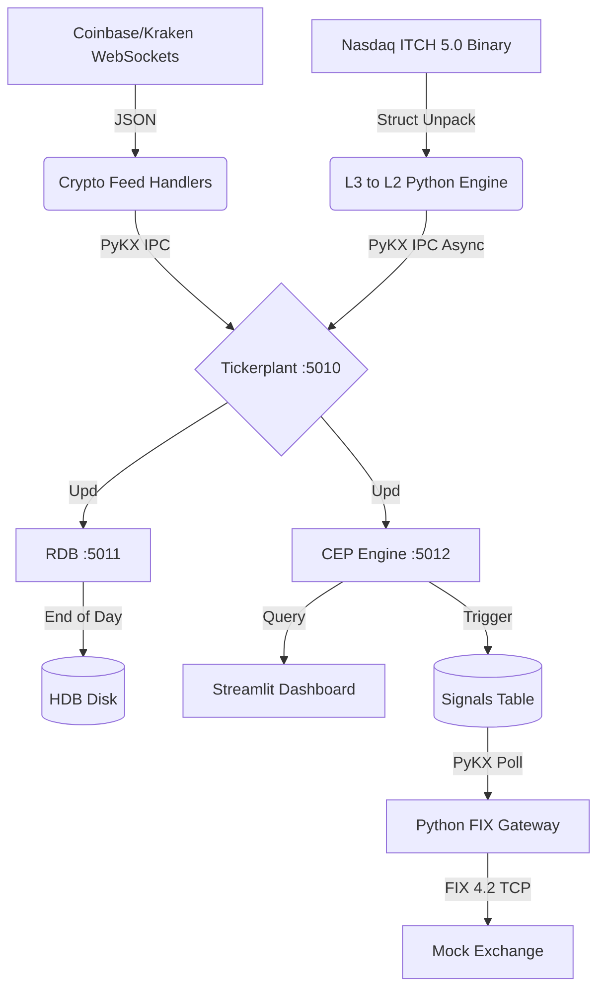

# Real-Time Market Data & Trading Engine (KDB+ / ITCH / Crypto)

   

## 📊 System Visualizations
| Crypto Real-Time Dashboard | Nasdaq L2 Depth of Market (Terminal) |
| :---: | :---: |
|  |  |
| *Live Streamlit dashboard visualizing 1-minute OHLC bars, VWAP, Order Book Imbalance, and Real-Time Spread Dynamics (Average & Max Spread) from KDB+ CEP engine.* | *Terminal-based Level 2 Order Book built from raw binary ITCH 5.0 payloads.* |

## 📖 Project Overview
This project is a high-frequency trading (HFT) data pipeline built with **KDB+/q** and **Python**. It mimics an institutional "Tick Architecture" to process both unstructured WebSockets (Crypto) and raw binary network streams (Traditional Equities) into a centralized, high-performance database with microsecond latency.

**Key Technical Capabilities:**
* **Level 3 Binary Data Parsing:** Engineered a highly optimized Python feed handler to ingest, decode, and process raw Nasdaq TotalView-ITCH 5.0 payloads.
* **Limit Order Book (LOB) State Machine:** In-memory tracking of the complete lifecycle of millions of equity orders (Add, Execute, Cancel, Replace, Delete) in real-time.
* **Level 3 to Level 2 Aggregation:** Extracts actionable Best Bid and Offer (BBO) signals from the L3 firehose, highly compressing data before async publication to KDB+.
* **Historical Data ETL:** High-performance Python ETL pipeline to extract Level 2 BBO from historical ITCH binaries and bulk load natively partitioned data directly to disk via `.Q.dpft`.
* **Crypto Ingestion:** Normalizes WebSocket JSON feeds (Coinbase, Kraken) into kdb+ IPC updates.
* **Complex Event Processing (CEP):** Real-time Vectorized VWAP, Order Book Imbalance, continuous OHLCV bar generation, and advanced Spread Analytics (tracking average and maximum spread to detect liquidity holes).
* **Persistence:** End-of-Day (EOD) logic to flush in-memory data to on-disk partitioned Historical Databases (HDB).
* **Ops & Observability:** Fully containerized microservices architecture with Prometheus and Grafana monitoring.

## 🏗️ Architecture Flow
The system follows a standard **kdb+tick** architecture, decoupled into microservices:



## 🧠 Architecture Concepts: Decoupling Data & Execution

A core design principle of this project is the strict separation of **Market Data Ingestion** from **Order Execution**, mirroring institutional High-Frequency Trading (HFT) environments.

### 1. Unified Symbology & First-Come-First-Served Data
The system ingests live crypto data simultaneously from multiple disconnected venues (Coinbase and Kraken). 
* **Symbology Mapping:** Feed handlers intercept exchange-specific tickers (e.g., Kraken's `XBT/USD`) and map them to a unified internal symbol (`BTC-USD`).
* **Interleaved Storage:** KDB+ **does not** average or alter the incoming prices. Data is appended to the `ticker` table sequentially in real-time on a strict first-come, first-served basis.
* **Global Order Book:** By maintaining unmodified prices under a single symbol, the Complex Event Processing (CEP) engine can evaluate a "Global Fair Value" and trigger algorithms (like Tight Spread detection) across the entire market simultaneously, regardless of the originating exchange.

### 2. Execution Routing (FIX Protocol)
When the CEP engine detects a trading opportunity, it generates an execution signal.
* The system relies on a standalone **FIX 4.2 Gateway** that polls KDB+ for signals and translates them into standardized Wall Street `New Order Single` payloads.
* Rather than sending the order directly back to Coinbase or Kraken via REST API, the Gateway routes it to a decoupled **Mock Matching Engine** (`mock_exchange.py`). 
* In a production environment, this mimics a **Smart Order Router (SOR)** dynamically directing trades to a Prime Broker or Dark Pool, completely independent of the venues providing the market data.

### 3. Algorithmic Execution Logic (Tight Spread)
To demonstrate a complete tick-to-trade lifecycle, this project implements a sample **Tight Spread / Market Maker** strategy:
* **Signal Generation (KDB+ CEP):** The CEP engine continuously evaluates the real-time spread (Ask - Bid) across the unified global order book. If the spread compresses to an ultra-tight threshold (e.g., ≤ $0.50 for BTC), indicating high liquidity and low execution friction, KDB+ instantly inserts a `BUY` order into the in-memory `signals` table.
* **Order Transmission (FIX Gateway):** The `fix_gateway.py` service continuously polls the KDB+ `signals` table. Upon detecting a newly generated signal, it constructs a standardized FIX 4.2 `New Order Single` (MsgType=D) string and transmits it over a TCP socket.
* **Order Matching (Mock Exchange):** Because we cannot send test orders to live institutional venues, `mock_exchange.py` acts as a dummy matching engine. It receives the inbound FIX 4.2 order, simulates exchange processing latency, and automatically replies with a FIX `Execution Report` (MsgType=8) confirming the order as "Filled".

## 🚀 Quick Start (Docker)
The easiest way to run the stack is via Docker Compose.

Prerequisites:

Docker Desktop installed.

A valid `kc.lic` (KDB+ License) placed in the root directory.

A `cdp_api_key.json` (Coinbase Credentials) in the root directory.

(Optional) Download the Nasdaq ITCH sample file and place it in a data/ directory.

1. Configure Environment
Create a .env file in the root directory to set your local hostname (required for KDB+ license validation).

```
cp .env.example .env
# Edit .env and set KDB_HOSTNAME to your machine's hostname (e.g., 'my-laptop')
```

2. Build & Run the KDB+ Stack

```
docker-compose build
docker-compose up -d
```

*Access the Crypto Dashboard at http://localhost:8501*

3. Start the Nasdaq ITCH Feed Handler

Once the Tickerplant is running, start the Python parser to stream Level 2 BBO updates into the KDB+ database:

```
python itch_parser_kdb.py
```

## 🛠️ Interacting with the Data

**Checking the RDB (Real-Time Database)**
You can connect directly to the in-memory database to query the live streams:

```
# Attach to the RDB container
docker exec -it kdb_rdb q -p 5011

# Inside the q terminal:
q) h:hopen 5011
q) h"count ticker"    / Check Crypto trades
q) h"count bbo"       / Check Nasdaq Level 2 updates
q) h"select top 10 from bbo"
```

**Historical Data ETL (Batch Processing)**
To bypass the Real-Time Tickerplant and bulk load historical data directly into the partitioned HDB:
```
python itch_hdb_etl.py
```
*This script parses the binary ITCH file, extracts the BBO, converts the data into pure KDB+ typed vectors, and natively saves it to disk via `.Q.dpft.`*

**Data Persistence (HDB)**
The system is designed to save data to disk automatically at midnight. To test this manually (Force EOD):
```
q) h:hopen 5011
q) h".u.end[.z.D]"
```
*This triggers the RDB to save in-memory tables to the hdb/ directory, partition them by date, and clear RAM.*

## ✅ Automated Testing
This project includes a regression test suite to verify the mathematical accuracy of the analytics engine (VWAP/Imbalance) before deployment.

Run Unit Tests:

`q tests.q`

Expected Output:

```
>>> RUNNING UNIT TESTS <<<
[PASS] Imbalance Calculation Correct (-0.5)
[PASS] VWAP Logic Correct (105.0)
[PASS] OHLC Buffer Ingestion Correct (2 rows)
```

## 📂 Project Structure

**Infrastructure & Analytics (KDB+)**
* `tick.q` - Master Tickerplant routing engine.
* `r.q` - Fault-tolerant Real-Time Database (RDB) with robust connection retry logic.
* `cep.q` - Complex Event Processing engine for VWAP, OHLC generation, Order Book Imbalance, Spread Analytics, and Algo Signal generation.
* `tick/sym.q` - Schema definitions for ticker (Crypto), bbo (Equities), and signals tables.
* `hdb/` - On-disk partitioned historical database.

**Market Data Handlers (Python)**
* `itch_parser_kdb.py` - Core L3 ITCH parser, L2 aggregator, and PyKX publisher.
* `itch_hdb_etl.py` - High-performance Historical ETL pipeline for bulk KDB+ HDB onboarding.
* `itch_parser_dash.py` - Terminal-based visual Depth of Market (DOM) ladder.
* `coinbase_feedhandler.py` - Async WebSocket ingestion for Coinbase.
* `kraken_feedhandler.py` - Async WebSocket ingestion for Kraken.

**Algo Execution (Python)**
* `fix_gateway.py` - KDB+ polling service that translates internal trading signals into raw FIX 4.2 network payloads.
* `mock_exchange.py` - TCP-based dummy matching engine that receives FIX orders and auto-replies with execution fill reports.

**Ops & Visuals**
* `dashboard.py` - Streamlit application querying the CEP engine to visualize OHLCV, VWAP, Imbalance, and Spread Dynamics.
* `docker-compose.yml` - Microservices orchestration.
* `prometheus.yml` / `monitor.q` - Infrastructure observability stack.